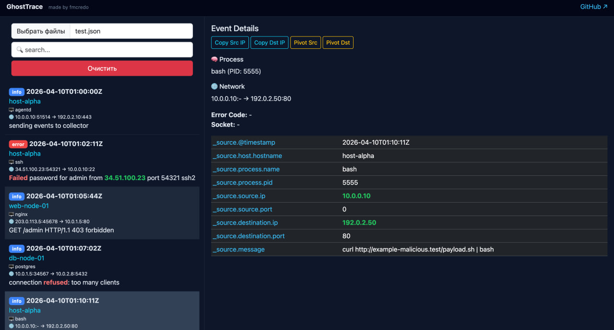

# 👻 GhostTrace


**GhostTrace** — это lightweight инструмент для SOC / Incident Response, позволяющий быстро анализировать JSON-логи без тяжёлых SIEM решений.

---

## 🚀 Возможности

- 🔍 Глобальный поиск по логам  
- 📊 Анализ событий (host, process, network)  
- 🌐 Pivot по IP (source / destination)  
- 🧠 Парсинг сообщений (error code, socket)  
- 🎯 Highlight подозрительных паттернов  
- 💾 LocalStorage (сохраняет данные в браузере)  

---

## 📸 Preview




---

## 📦 Установка

```bash
git clone https://github.com/ArturDuisheev/ghosttrace.git
cd ghosttrace
